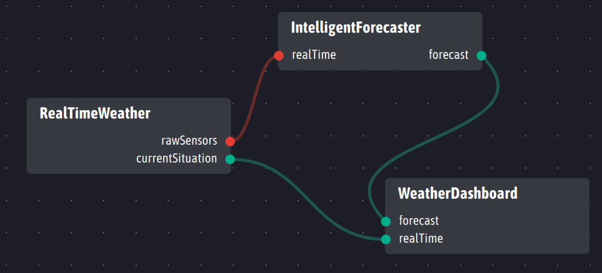
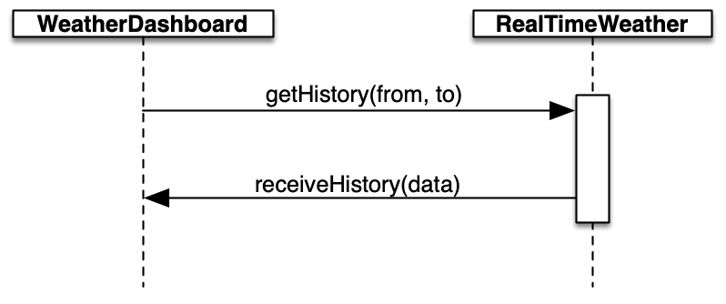
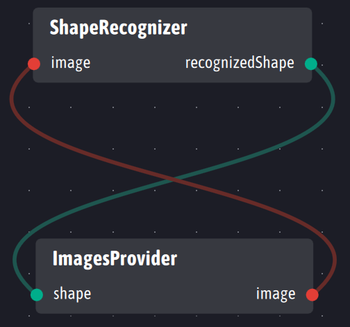
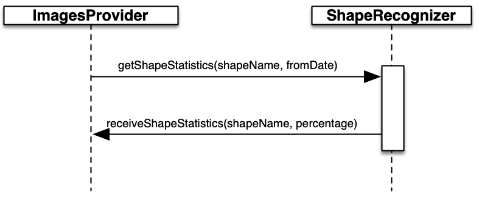

# Ingescape - Model-based framework for broker-free distributed software environments

**[Overview](#overview)**

**[Scope and Goals](#scope-and-goals)**

**[Ownership and License](#ownership-and-license)**

**[Dependencies with other open source projects](#dependencies-with-other-open-source-projects)**

**[Building and installing Ingescape](#building-and-installing-ingescape)**

*  [Ingescape and dependencies](#ingescape-and-dependencies)
*  [Ingescape only](#ingescape-only)
*  [Testing](#testing)
*  [Helper scripts](#helper-scripts)

**[Using Ingescape - a simple example (or two)](#using-ingescape---a-simple-example-or-two)**

*  [Modeling the agents](#modeling-the-agents)
*  [The code and compilation](#the-code-and-compilation)
*  [Same example using external models as resources](#same-example-using-external-models-as-resources)

**[API Summary](#api-summary)**

**[Hints to contributors](#hints-to-contributors)**


## Overview
Ingescape is a framework for the orchestration of broker-free distributed heterogeneous software (any language, any OS) running on different threads or processes on a computer, different computers on a local network, and different networks, even through the Internet. All these orchestrated distributed software are called Ingescape **agents**. An Ingescape **platform** is a set of agents meshed together and able to communicate in a fully decentralized way.

Ingescape brings a neat and easy model-based approach to describe and enforce the communications between agents. The model supports:

- **Data flow** : Agents expose named and typed inputs and outputs. Each agent describes a mapping between its inputs and outputs of other agents resulting in a global data flow architecture. Ingescape data flow uses high-speed, low-latency PUB/SUB communications from outputs of  agents to inputs of other agents, with the optional capability to dispatch data between workers for workload distribution.




- **Request/reply services**: Agents expose named services with named and typed parameters that are equivalent to REST-like web services on one hand and RPC/RMI solutions on the other hand. Any agent can both expose its own services and use services from other agents, without strict client/server segmentations.



Because Ingescape is developed in C, it can be used out of the box in C++ and Objective-C and bindings can be created for practically any programming language on any operating system. At the moment,  official bindings exist for C#, Python, QML Javascript and NodeJS Javascript. Android Java, Oracle JRE Java and web-app Javascript are also supported with some peculiarities. If you need support for another language, please create an issue or - even better - submit your binding as a merge request!


## Scope and Goals

Ingescape provides the concepts to build, implement and monitor modern heterogeneous distributed systems with interesting new capabilities. To do so, Ingescape merges the concepts of request/reply communications with the various popular producers/brokers/consumers network patterns, into a consistent, minimal set. The resulting expressivity enables Ingescape to handle 99.9% of the network-based communication patterns, going much further than any third-party technology taken individually. And if you need to go into the 0.1%, ZeroMQ is there as a backup for highly customized architectures.

At the same time, Ingescape remains open and makes it remarkably easy to interoperate with many other related technologies including Apache Kafka, RabbitMQ, MQTT, OpenDDS, ROS, etc.

**Ingescape platforms are broker-free and fully decentralized.** This means that the Ingescape agents in a distributed platform never rely on any kind of central entity. They are meshed together in a P2P manner and remain as loosely-coupled as possible. On an Ingescape platform, agents can be clients and/or servers, producers and/or consumers, all this at the same time. In this context, Kafka-like or MQTT-like brokers are irrelevant because producers and consumers communicate directly. Most of the time, agents discover one another automatically using UDP broadcast (zbeacons). Ingescape can also use  actual brokers (zgossip), i.e. go-betweens in charge only of putting agents in relation and not misnamed servers whose failure would make the system collapse.

**Ingescape platforms are fully dynamic.** Agents can add, edit or remove inputs, outputs and services at any time. Mappings between inputs and outputs can be added or removed at any time as well. Agents can come and go on a platform as often as they like. Multiple instances of agents are properly supported. In all cases, Ingescape manages the overall consistency automatically and each agent can subscribe to events to get informed and adapt to any of these changes if they need to. Data routing is handled automatically on-the-fly by the Ingescape library in each agent, based on the active mappings at a given time.

**Ingescape is thread-safe with a low code footprint.** In a given software process or application, the Ingescape API enables to create and control one or several agents from any number of threads. This means that existing code is very lightly affected by the introduction of Ingescape: the Ingescape code  integrates surgically with the existing one, independently from the architecture in place. For heavy data computation, Ingescape  integrates seamlessly in the most advanced parallel and multi-threaded architectures, whether to handle received data or to send to other agents.

**Ingescape is multi-transport... And you have nothing to do to benefit from it!** Based on the slick ZeroMQ multi-transport capabilities and Ingescape meshed network, each agent chooses automatically the most efficient transport to support data flows with each other agent. If the two agents are in the same process, shared memory is used. If the agents are on the same computer IPC (for UNIX boxes) or the Loopback (Windows) is used. And for the other cases, TCP is the preferred choice. With this ability, Ingescape agents minimize the latency, increase the bandwidth and optimize the network depending on its actual topology.

**Ingescape is secure.** The Ingescape library supports the ZeroMQ security layer using public/private certificates (SASL, Curve25519, 256 bits keys). This way, agents can validate their identity to others, platforms are joined by allowed agents only (i.e. agents will communicate only if they know each other's identity), and all communications are encrypted.

Other relevant characteristics:

- Ingescape inputs, outputs and services support the following types: impulsions, bool/int/double numbers,  strings, raw binary data.
- Raw binary data can be of any type and it is simple to use Ingescape in combination with Protobuf.
- Agents definitions and mappings can be written to and read from an open JSON format support by the Ingescape library.
- Ingescape comes with logging functions supporting the console, files and data streams to access the logs remotely in real-time.
- Based on Zyre capabilities, Ingescape supports elections between competing agents, e.g. master/slave determination.


## Ownership and License

The contributors are listed in AUTHORS. This project uses the MPL v2 license, see LICENSE.
Ingescape uses the C4.1 (Collective Code Construction Contract) process for contributions.
To report an issue, use the Ingescape issue tracker at github.com.


## Dependencies with other open source projects

Ingescape relies on the following libraries:

- libzmq as the core network library for the communication between agents using underlying ZeroMQ communication patterns,
- czmq as a wrapper to the library and for its additional, extremely useful services,
- zyre as the cornerstone for meshed networks with discovery mechanisms,
- libsodium for everything crypto.

Ingescape also embeds:

-  A lightly modified version of the Yajl JSON parser and generator. See the corresponding source files for related ownership and licence.
- Uthash for inline macros bringing lists and hash tables.  See the corresponding source files for related ownership and licence.


## Building and installing Ingescape

Ingescape is  designed primarily to be compiled and installed using cmake, which offers powerful means to generate projects for other types of IDEs or solutions. In addition, Ingescape offers pre-configured projects for the following targets:

- Xcode
- Qt Creator with both a PRI and a PRO projects
- Visual studio

By commodity, Ingescape includes its dependencies as a set of git submodules. Please use the proper git command to pull them as well. The cmake compilation can either compile and install Ingescape and all its dependencies, or compile and install ingescape only, if you want to manage the dependencies externally or if they are already on your system.


### Ingescape and dependencies

Dependencies are fetched from forks managed by the ingescape team on github and used for long-term industrial maintenance. This is the best way to have a full stack for debugging and contributing to ingescape, using your preferred environment.

	git clone --recurse-submodules git://github.com/zeromq/ingescape.git
	cd ingescape
	mkdir build
	cmake -S . -B build -DCMAKE_BUILD_TYPE=Debug -DOSX_UNIVERSAL=ON \
	-DCMAKE_OSX_DEPLOYMENT_TARGET=10.11 -DWITH_DEPS=ON
	make -j8 -C build
	sudo make -C build install
	sudo ldconfig

### Ingescape only

All the dependencies need to be fetched and installed from their official repositories using the latest master or stable tags. Because Ingescape uses draft APIs from CZMQ and Zyre, compilation might rarely break depending on their respective evolutions and the delay to make the necessary updates.

 	git clone --depth 1 -b stable https://github.com/jedisct1/libsodium.git
    cd libsodium
    ./autogen.sh && ./configure && make check
    make -j8
    sudo make install
    cd ..

    git clone git://github.com/zeromq/libzmq.git
    cd libzmq
    mkdir build
    cmake -S . -B build -DCMAKE_BUILD_TYPE=Debug -DWITH_LIBSODIUM=ON -DENABLE_DRAFTS=ON -DWITH_TLS=OFF -DCMAKE_OSX_DEPLOYMENT_TARGET=10.11
    make -j8 -C build check
    sudo make -C build install
    sudo ldconfig
    cd ..

    git clone git://github.com/zeromq/czmq.git
    cd czmq
    mkdir build
    cmake -S . -B build -DCMAKE_BUILD_TYPE=Debug -DENABLE_DRAFTS=ON -DCMAKE_OSX_DEPLOYMENT_TARGET=10.11
    make -j8 -C build check
    sudo make -C build install
    sudo ldconfig
    cd ..

    git clone git://github.com/zeromq/zyre.git
    cd zyre
    mkdir build
    cmake -S . -B build -DCMAKE_BUILD_TYPE=Debug -DENABLE_DRAFTS=ON -DCMAKE_OSX_DEPLOYMENT_TARGET=10.11
    make -j8 -C build check
    sudo make -C build install
    sudo ldconfig
    cd ..

	git clone git://github.com/zeromq/ingescape.git
	cd ingescape
    mkdir build
	cmake -S . -B build -DCMAKE_BUILD_TYPE=Debug -DCMAKE_OSX_DEPLOYMENT_TARGET=10.11
	make -j8 -C build
	sudo make -C build install
	sudo ldconfig
    cd ..


### Testing
Two test programs are built and installed with Ingescape. They are called *igsTester* and *igsPartner* and are installed in /usr/local/bin on \*nix boxes. They enable various series of tests - static and dynamic - to check the library. **They are optional if you are a user and not a contributor.**

#### Static tests on most of the API
```
# adjust device and port depending on your computer
igsTester --device "en0" --port 5670 --static
```
These tests call almost all functions in the API and verify their results with assertions. If the program runs properly (despite a lot of expected error messages in the console) and terminates by returning 0, it means that everything went OK.


#### Dynamic tests
In a console, run:
```
igsPartner --device "en0" --port 5670 --verbose --auto
```
In another console, run:
```
igsTester --device "en0" --port 5670 --verbose --auto
```
Both agents discover each other and run tests automatically. If the two programs run properly (despite a lot of expected error messages in the console) and both terminate by returning 0, it means that everything went OK.

#### Interactive tests
The two agents also provide advanced console commands to test security, brokers, additional agents in the process, etc.

The command lines to enable interactive testing are the following:
```
igsPartner --device "en0" --port 5670 --verbose --interactiveloop
igsTester --device "en0" --port 5670 --verbose --interactiveloop

#in each console, then type /help to display the available console commands
/help
Available commands in the terminal:
	/publish : runs the iop publication tests
	/services : runs the service tests
	/channels : runs the channels tests
	/editor agent_uuid : runs the editor (i.e. private bus API) tests on a specific agent
	/activate : activates secondAgent
	/deactivate : deactivates secondAgent
	/service_local : firstAgent calls service secondCall on secondAgent
	/gossip : restart in gossip mode
	/security : restart and enable security in gossip mode (edit code to use self-discovery instead of gossip)
	/quit : quits the agent
	/help : displays this message
```

### Helper scripts
Two scripts are provided at the root of the repo:

- **bootstrap_sysroot.sh** is run without any parameter. It creates a *sysroot* directory at the same level as the repo dir and compiles and installs the library and its dependencies inside it. This script also creates the xcode projects for the dependencies, which are necessary for the main xcode project located in builds/xcode and specific to each repo location. If you are not using macos, just ignore the created xcode dirs.
- **install\_on\_system.sh** is a simple commodity script to install Ingescape and its dependencies on your system. This should work on any *nix and windows boxes using cmake.


## Using Ingescape - a simple example (or two)

To illustrate the use of mappings between inputs/outputs and the use of services, we build bogus examples for two agents.


### Modeling the agents

**ShapeRecognizer** receives image data on its input and provides a corresponding string with a recognized shape on its output. ShapeRecognizer exposes a getShapeStatistics service expecting a shapeName (string) and a fromDate (integer) as parameters. The getShapeStatistics answers with a receiveShapeStatistics call to the caller, providing a shapeName (string) and a percentage parameters.

**ImagesProvider** receives a string on its shape input and sends bogus image data on its output every second. Every five seconds, it calls the getShapeStatistics service on ShapeRecognizer and exposes a receiveShapeStatistics service to get the answers.

Both agents are coded to map their input to each other's output. It is illustrated this way :



Services are designed to communicate this way:




### The code and compilation

Here is the code for the **ShapeRecognizer** agent to be copied into a main.c file:

	//
	//  main.c
	//  ShapeRecognizer version 1.0
	//  Created by Stéphane Valès on 2021/07/23
	//
	//  no description
	//

	#ifdef _WIN32
	#define WIN32_LEAN_AND_MEAN
	#define NOMINMAX
	#include <windows.h>
	#include <winsock2.h>
	#endif

	#include <ingescape/ingescape.h>

	void imageCallback(igs_iop_type_t iopType, const char* name, igs_iop_value_type_t valueType,
	                   void* value, size_t valueSize, void* myData){
	    igs_info("%s received (%zu bytes)", name, valueSize);
	    //doing some sophisticated AI stuff here...
	    igs_output_set_string("recognizedShape", "Rectangle");
	}

	void shapeStatisticsFunction(const char *senderAgentName, const char *senderAgentUUID,
	                             const char *callName, igs_service_arg_t *firstArgument, size_t nbArgs,
	                             const char *token, void* myData){
	    igs_info("%s(%s) called %s with parameters:", senderAgentName, senderAgentUUID, callName);
	    igs_info("    shapeName : %s", firstArgument->c);
	    igs_info("    from date : %d", firstArgument->next->i);

	    //composing bogus statistics and sending them
	    igs_service_arg_t *list = NULL;
	    igs_service_args_add_string(&list, firstArgument->c);
	    igs_service_args_add_int(&list, 65);
	    igs_service_call(senderAgentUUID, "receiveShapeStatistics", &list, token);
	}

	int main(int argc, const char * argv[]) {
	    int nb = 0;
	    char **devices = igs_net_devices_list(&nb);
	    printf("list of network devices for your computer:\n");
	    for (int i = 0; i < nb; i++)
	        printf(" %s\n", devices[i]);
	    printf("Use one of them in igs_start_with_device.\n");
	    igs_free_net_devices_list(devices, nb);

	    igs_log_set_console(true);
	    igs_log_set_file(true, NULL);
	    igs_log_set_stream(true);
	    igs_agent_set_name("ShapeRecognizer");

	    igs_definition_set_version("1.0");

	    igs_input_create("image", IGS_DATA_T, 0, 0);
	    igs_observe_input("image", imageCallback, NULL);
	    igs_mapping_add("image", "ImagesProvider", "image"); //map our image input to the ImagesProvider agent

	    igs_output_create("recognizedShape", IGS_STRING_T, 0, 0);

	    igs_service_init("getShapeStatistics", shapeStatisticsFunction, NULL);
	    igs_service_arg_add("getShapeStatistics","shapeName", IGS_STRING_T);
	    igs_service_arg_add("getShapeStatistics","fromDate", IGS_INTEGER_T);

	    igs_start_with_device("en0", 5670); //customize the network device based on your computer

	    getchar(); //returns when entering any character in the console

	    igs_stop();
	    return 0;
	}


And here is how to compile it in a minimal way using gcc:

	gcc -Wall -g -I/usr/local/include/ -std=gnu99 -o main.o -c main.c
	gcc -o ShapeRecognizer main.o -L/usr/local/lib -lingescape
	./ShapeRecognizer

The compilation requires  linking against the Ingescape library only.

Here is the code for the **ImagesProvider** agent to be copied into another main.c file:

	//
	//  main.c
	//  ImagesProvider version 1.0
	//  Created by Stéphane Valès on 2021/07/23
	//
	//  no description
	//

	#ifdef _WIN32
	#ifndef WIN32_LEAN_AND_MEAN
	#define WIN32_LEAN_AND_MEAN
	#endif
	#define NOMINMAX
	#include <windows.h>
	#include <winsock2.h>
	#endif

	#include <ingescape/ingescape.h>

	void shapeCallback(igs_iop_type_t iopType, const char* name, igs_iop_value_type_t valueType,
	                   void* value, size_t valueSize, void* myData){
	    igs_info("%s recognized as %s", name, (char*)value);
	}

	void shapeStatisticsFunction(const char *senderAgentName, const char *senderAgentUUID,
	                             const char *callName, igs_service_arg_t *firstArgument, size_t nbArgs,
	                             const char *token, void* myData){
	    igs_info("%s(%s) called %s with parameters:", senderAgentName, senderAgentUUID, callName);
	    igs_info("    shapeName : %s", firstArgument->c);
	    igs_info("    percentage : %d", firstArgument->next->i);
	}

	int publishImage(zloop_t *loop, int timer_id, void *arg){
	    void *image = malloc(128); //create bogus data
	    igs_output_set_data("image", image, 128);
	    free(image);
	    igs_info("publish image data");
	    return 0;
	}

	int askStatistics(zloop_t *loop, int timer_id, void *arg){
	    igs_service_arg_t *list = NULL;
	    igs_service_args_add_string(&list, "Rectangle");
	    igs_service_args_add_int(&list, 1627033669);
	    igs_service_call("ShapeRecognizer", "getShapeStatistics", &list, "bogus_query_id");
	    igs_info("ask ShapeRecognizer for statistics using getShapeStatistics service");
	    return 0;
	}

	int main(int argc, const char * argv[]) {
	    int nb = 0;
	    char **devices = igs_net_devices_list(&nb);
	    printf("list of network devices for your computer:\n");
	    for (int i = 0; i < nb; i++)
	        printf(" %s\n", devices[i]);
	    printf("Use one of them in igs_start_with_device.\n");
	    igs_free_net_devices_list(devices, nb);

	    igs_log_set_console(true);
	    igs_log_set_file(true, NULL);
	    igs_log_set_stream(true);
	    igs_agent_set_name("ImagesProvider");

	    igs_definition_set_version("1.0");

	    igs_input_create("shape", IGS_STRING_T, 0, 0);
	    igs_observe_input("shape", shapeCallback, NULL);
	    igs_mapping_add("shape", "ShapeRecognizer", "recognizedShape");

	    igs_output_create("image", IGS_DATA_T, 0, 0);

	    igs_service_init("receiveShapeStatistics", shapeStatisticsFunction, NULL);
	    igs_service_arg_add("receiveShapeStatistics","shapeName", IGS_STRING_T);
	    igs_service_arg_add("receiveShapeStatistics","percentage", IGS_INTEGER_T);

	    igs_start_with_device("en0", 5670); //customize the network device based on your computer

	    zloop_t *loop = zloop_new();
	    zloop_timer(loop, 1000, 0, publishImage, NULL);
	    zloop_timer(loop, 5000, 0, askStatistics, NULL);
	    zloop_start(loop); //will terminate on interruption or Ctrl+C

	    igs_stop();
	    return 0;
	}

And here is how to compile it in a minimal way using gcc:

	gcc -Wall -g -I/usr/local/include/ -std=gnu99 -o main.o -c main.c
	gcc -o ImagesProvider main.o -L/usr/local/lib -lingescape -lczmq
	./ImagesProvider

Because with use a CZMQ zloop in our example, the compilation requires linking against the Ingescape and CZMQ libraries.

You may be surprised by the almost complete absence of network code in these examples. This is the main objective of Ingescape: focusing on the exchanging data rather than on managing network connections. For the two agents to discover each other and establish communication, there is only one line of code that matters:

	igs_start_with_device("en0", 5670); //customize the network device based on your computer

This function starts an agent on the network, using a network device on your computer and a network port that shall be free from any TCP binding. The list of network devices for your computer is displayed by this code:

	int nb = 0;
	char **devices = igs_net_devices_list(&nb);
	printf("list of network devices for your computer:\n");
	for (int i = 0; i < nb; i++)
		printf(" %s\n", devices[i]);
	printf("Use one of them in igs_start_with_device.\n");
	igs_free_net_devices_list(devices, nb);

Depending on your computer and operating system, network device names may be very different. On Windows, you may expect things like "Ethernet 2", "Wi-Fi" or "Loopback". On UNIX systems, expect things like "eth0" or "en0". If the list is empty, this means that no active network device exists on your computer and that you should enable WiFi or plug an ethernet cable.
Between two agents on the same computer, use the same device and port. Between two agents on two different computers, use the same port and devices connected to the same local network. When this is done, the two agents discover and connect to each other automatically.

When the two agents are finally running on the same port, on the same network device or same local network, images published by ImagesProvider on its image output are received by ShapeRecognizer on its image input. When this happens, ShapeRecognizer publishes a recognized shape on its recognizedShape output, that is finally received by ImagesProvider on its shape input. In the same way, getShapeStatistics and receiveShapeStatistics services answer one to the other. All communications (output publication and service call) are initiated by ImagesProvider based on the two zloop timers.

Communications can be checked in the console or in the log files that are create in ~/Documents/Ingescape/logs.


### Same example using external models as resources

The Ingescape library supports models for the definitions of the agents and their mapping inside a given platform. There are two ways to declare a model:

- Using the API to hardcode it
- Loading a JSON resource file representing the model

Here is the JSON definition for **ShapeRecognizer**:
```
{
    "definition": {
        "name": "ShapeRecognizer",
        "version": "1.0",
        "inputs": [
            {
                "name": "image",
                "type": "DATA"
            }
        ],
        "outputs": [
            {
                "name": "recognizedShape",
                "type": "STRING",
                "value": ""
            }
        ],
        "parameters": [

        ],
        "services": [
            {
                "name": "getShapeStatistics",
                "arguments": [
                    {
                        "name": "shapeName",
                        "type": "STRING"
                    },
                    {
                        "name": "fromDate",
                        "type": "INTEGER"
                    }
                ]
            }
        ]
    }
}
```

And here is the JSON mapping for **ShapeRecognizer**:
```
{
    "mappings": [
        {
            "fromInput": "image",
            "toAgent": "ImagesProvider",
            "toOutput": "image"
        }
    ],
    "splits": [

    ]
}
```

Instead of using the API to hardcode the definition and the mapping, the two JSON files can be loaded as external resources. The modified code in the main function is as follows:

	int main(int argc, const char * argv[]) {
		int nb = 0;
		char **devices = igs_net_devices_list(&nb);
		printf("list of network devices for your computer:\n");
		for (int i = 0; i < nb; i++)
		    printf(" %s\n", devices[i]);
		printf("Use one of them in igs_start_with_device.\n");
		igs_free_net_devices_list(devices, nb);

		igs_log_set_console(true);
		igs_log_set_file(true, NULL);
		igs_log_set_stream(true);
		igs_definition_load_file("ShapeRecognizer.json");
		igs_mapping_load_file("ShapeRecognizer_mapping.json");

		igs_observe_input("image", imageCallback, NULL);

		igs_service_init("getShapeStatistics", shapeStatisticsFunction, NULL);

		igs_start_with_device("en0", 5670); //customize the network device based on your computer

		getchar(); //returns when entering any character in the console

		igs_stop();
		return 0;
	}

All the functions used to create inputs, outputs, services and their arguments become useless when loading a model. The only remaining functions are the ones enabling to observe inputs and link services with the actual code. The models also cover the creation of mapping entries, avoiding specific code for this.

## API Summary

The Ingescape library comes with two headers. The _ingescape.h_ header is dedicated to the global functions and the API to use when you only have one agent in your process or application. The second header, _igsagent.h_, provides all the specific functions dedicated to several agents inside the same process. Basically, _igsagent.h_ provides a subset of the _ingescape.h_ functions with a different prefix and an agent pseudo-object as first parameter, plus new/destroy/activate/deactivate specific capabilities.

The global Ingescape API is centralized in a single header file. The header is heavily commented, with examples when it is relevant.
Here is the structure of ingescape.h:

- Agent initialization, control and events
- Editing & inspecting definitions, adding and removing inputs/outputs/parameters
- Reading and writing inputs/outputs/parameters
- Mappings edition & inspection
- Services edition & inspection
- Timers
- Communicating via channels
- Brokers (when self-discovery is not possible)
- Security
- Elections and leadership between agents
- Administration, logging, configuration and utilities
	- Logging functions
	- Version, command line, logging parameters, definition and mapping path, IPC transport configuration
	- Advanced network configuration and monitoring
- JSON parsing and generation


## Hints to contributors

Ingescape has built an architecture and data exchange model above some amazing ZeroMQ technologies. Please keep that in mind to decide where to contribute between CZMQ, Zyre and Ingescape.

The Ingescape API does not fully comply  with the CLASS style guide yet but progressively get closer. We already share its objectives of simplicity and minimalism. Do read your code after you write it and ask, "Can I make this simpler?"
